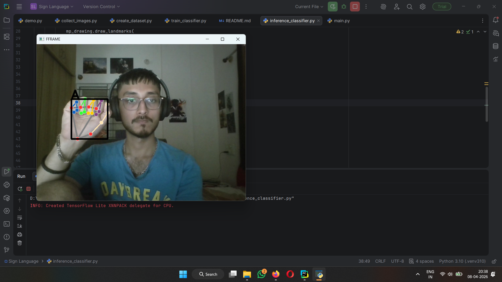
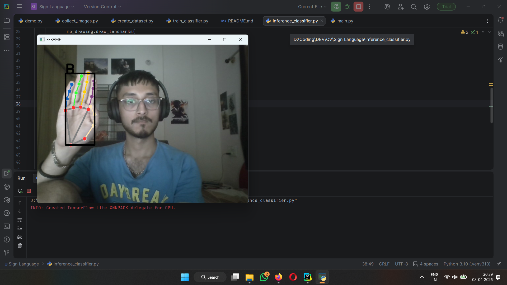
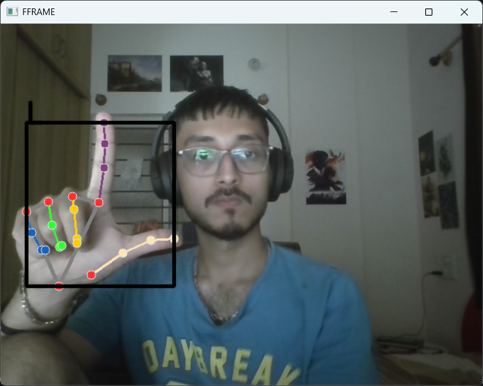

# ✋ Sign Language Recognition using MediaPipe & Machine Learning

A real-time hand gesture recognition system that classifies sign language letters using **MediaPipe hand landmarks** and a **Random Forest classifier**.

---

## 📌 Overview

This project builds an end-to-end pipeline for recognizing hand gestures:

* 📷 Capture images using webcam
* 🧠 Extract hand landmarks using MediaPipe
* 🏗️ Create a structured dataset
* 🤖 Train a machine learning model
* 🎯 Perform real-time inference

---

## 🧠 Key Idea

Instead of using raw images, we:

* Detect **21 hand landmarks**
* Each landmark has **(x, y, z)** coordinates
* Convert each image into a **63-dimensional feature vector**

```
21 landmarks × 3 values = 63 features
```

This makes the system:

* Faster ⚡
* Lightweight 🪶
* More robust to background noise 🎯

---

## 🗂️ Project Structure

```
.
├── collect_images.py        # Capture dataset
├── create_dataset.py        # Extract landmarks
├── train_classifier.py      # Train ML model
├── inference_classifier.py  # Real-time prediction
├── model.p                  # Trained model
├── data.pickle              # Dataset
├── README.md
└── images/
    ├── A.png
    ├── B.png
    ├── C.png
```

---

## 📷 Dataset Creation

Run:

```bash
python collect_images.py
```

* Captures images from webcam
* Stores them in class-wise folders
* Currently supports **3 gesture classes**:

  * A
  * B
  * L

---

## 🔍 Feature Extraction

Run:

```bash
python create_dataset.py
```

* Uses MediaPipe Hands
* Extracts landmarks from each image
* Converts each image → **63-length vector**
* Saves dataset to:

```
data.pickle
```

---

## 🤖 Model Training

Run:

```bash
python train_classifier.py
```

* Uses **RandomForestClassifier** (from scikit-learn)
* Trains on landmark features
* Saves trained model:

```
model.p
```

---

## 🎯 Real-Time Inference

Run:

```bash
python inference_classifier.py
```

### Pipeline:

1. Capture webcam frame
2. Detect hand landmarks
3. Convert to feature vector (`data_aux`)
4. Predict using trained model
5. Draw:

   * Bounding box (`cv2.rectangle`)
   * Predicted label (`cv2.putText`)

---

## 📦 Demo


---

## 🖼️ Sample Gestures

### A



### B



### L



---

## ⚙️ Tech Stack

* Python
* OpenCV
* MediaPipe
* NumPy
* Scikit-learn

---

## 🚀 Advantages

* Real-time performance
* Lightweight (no deep learning required)
* Robust to background variations
* Easy to extend

---

## 📈 Future Development

This project is currently limited to recognizing a small subset of gestures. The following improvements are planned:

### 🔤 Expand Gesture Vocabulary

* Extend support from **3 letters to 6+ letters**, and eventually the full sign language alphabet
* Improve dataset diversity for better generalization

### 🧠 Word & Sentence Formation

* Combine sequential predictions to form **complete words**
* Implement basic **language modeling** to generate semantically correct words or sentences
* Handle ambiguity by predicting the most likely word from gesture sequences

### 🎥 Temporal Modeling

* Move beyond single-frame predictions
* Use **time-based models (e.g., LSTM/sequence models)** to capture motion and transitions between gestures

### 🎯 Accuracy Improvements

* Normalize landmark positions for scale and translation invariance
* Add smoothing/filtering to reduce prediction flickering
* Experiment with advanced models (e.g., SVM, Neural Networks)

### 🌐 Deployment

* Build a **web or mobile interface** for real-time usage
* Optimize for lower latency and better performance on edge devices

### 🗣️ Speech Integration

* Convert predicted text into **speech output** (text-to-speech)
* Enable real-time communication assistance

---

This roadmap aims to evolve the project from a simple gesture classifier into a **complete sign language interpretation system**.


## 🙌 Acknowledgements

* MediaPipe by Google
* OpenCV community
* Scikit-learn contributors

---

## 📜 License

This project is open-source and available under the MIT License.

---
